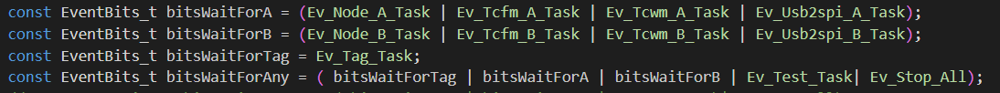
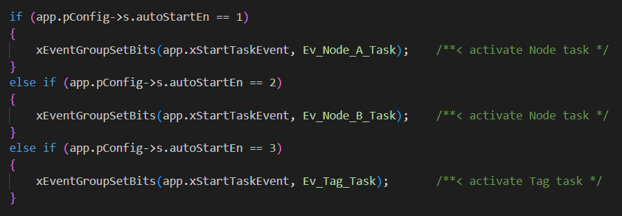
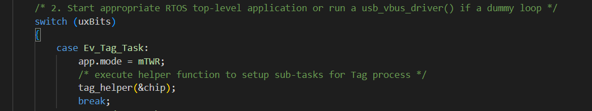
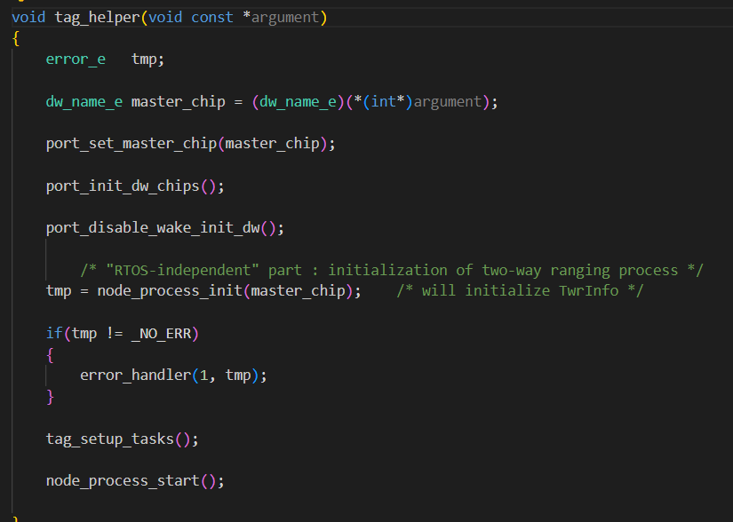
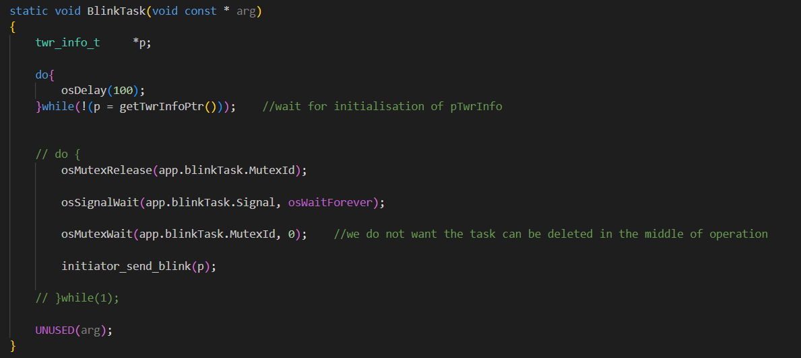
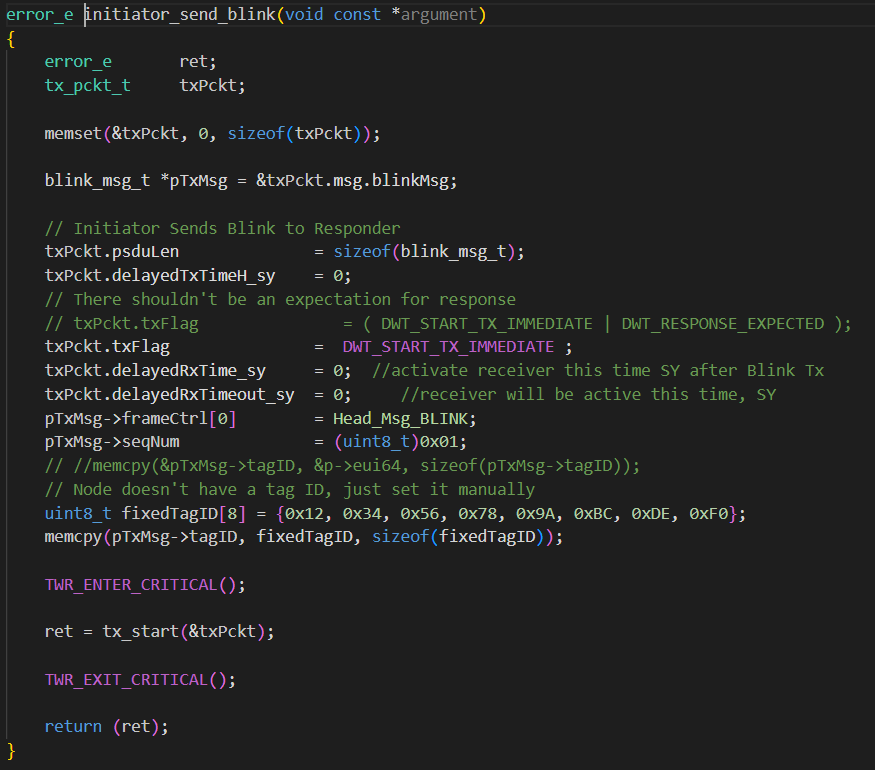
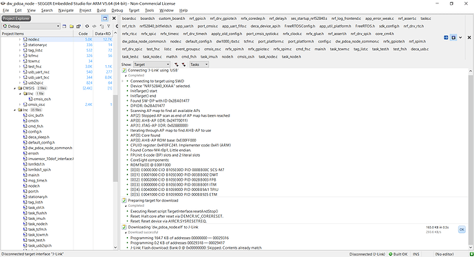

# Make DWM 1002 Node Module Be a Tag with Multiple Antennas

## Motivation

It is known that DWM 1002 Module has two DW 1000 chips or two transceivers. In theory, it should also be able to serve as the tag with multiple antennas.
But in practice, this module is only used as the node/anchor and use PDOA to calculate the AOA with the phases received by the two antennas.
Therefore, I wonder whether the DWM 1002 Module can be used as the tag and if doable, how to modify the source code or how to program to achieve the function.

## Implementation

**The general process is as follows:**

1.I obseve that there is a declaration of the Ev_Tag_Task which is not used in node module and it is related to the event bit, as the following figure shows

Therfore, what I have done here is to add the eventBit(Additionaly, I also need to modify the cmd to achieve the mode switch) and set the run-time parameter s.autoStartEn be 3 for Ev_Tag_Task if I want to activate the tag task instead of the node task after reset/power-on(I am confident that this is doable by passing a AOTO 3, what do you think of it?)

[

[

2.After that, I added and implemented the sending-blink functionality in function tag_helper() when the case is Ev_Tag_Task

[

3.For tag_helper() this function, I remained the basic strcture of the node, including the choice of the master chips and initiation of chips, disable_wake_init, initialization of two-way ranging process and node_process_start() which is to enable_dw1000_irq.

4.What I modified in helper function was about the setup of tasks.

I defined the task signal the thread: blinkTask

5.The core code is initiator_send_blink in function BlinkTask(). 

In initiator_send_blink, I define and instantialte the blink packet to be transmitted. And then call the function tx_start to send the packet(In addition, I need to set different SPI for different chips in tx_start in order to achieve the multiple antenna transmissions)

## Result

Eventually, I build and run the modified code successfully! And the functionality remains to be verified.

## Reference

[Can I use PDOA-NODE-DWM 1002 Module as the tag with multiple antennas? - Wireless Connectivity / Ultra-Wideband - Qorvo Tech Forum](https://forum.qorvo.com/t/can-i-use-pdoa-node-dwm-1002-module-as-the-tag-with-multiple-antennas/18335)

[Run and Bulid Error in DWM 1002 Module - Wireless Connectivity / Ultra-Wideband - Qorvo Tech Forum](https://forum.qorvo.com/t/run-and-bulid-error-in-dwm-1002-module/18472/5)
